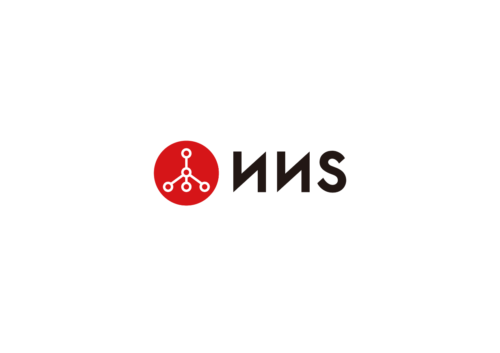

***************
NNS Background 
***************

NNS is the NEO Name Service, a distributed, open, and extensible naming system based on the NEO blockchain. 

Our primary goal is to replace irregular string such as wallet address and smart contract Hash which are hard to memorize for humans with words and phrases. 
We will offer ending in“.neo” name service first. 

Through name service, people don’t need to remember address and Hash they don’t understand anymore. 
You could make a transfer or use contracts by just knowing a word or phrase. 

NNS can be used to resolve a wide variety of resources. 
The initial standard for NNS defines resolution for NEO addresses or Smart contracts(ScriptHash), but the system is extensible, 
allowing more resource types to be resolved in future without NNS upgrades.

Why do We Need NNS?
====================

When Satoshi Nakamoto designed Bitcoin address, he created base58 encode by himself rather than adopting base 64 encode commonly used in coding community.
In the base58 encode, he deleted some ambiguous characters: 0(zero), O(capital letter o), I(capital letter i) and l( lower case letter L). 

This reflects Satoshi Nakamoto’s consideration for the usability of blockchain address. However, blockchain address is still not human-friendly enough, 
because it’s too long, hard to memorize and not easy to compare whether it’s right or wrong. 
As blockchain’s popularity increases, the shortcomings of its address will be more obvious. 

As we won’t use a 32-byte string as an E-mail account today, alias service could provide a huge help for the usability of blockchain system. 
As IPFS has its alias service IPNS, and Ethereum ENS, We argue that NEO system should have its own alias service. 
We call it as NEO Name Service(NNS), NEL community will increase the usability of NEO blockchain by providing NNS service. 

The primary usage scenario of alias service is transfer of tokens via alias, especially for those accounts who need to make public their wallet addresses and do not need to change their addresses frequently.
For example, when an ICO is underway, the project initiator need to make public its official wallet address on its official website. 

But even the official wallet address is modified by hackers, it is difficult for investors to notice that. 
So if the project initiator could make public a short and easy-to-remember address alias, then even it’s modified, it could be easily found, 
thus preventing wallet address from being modified by hackers.
What types of resource an alias points to is extensible, as long as corresponding resolver is achieved. 

Besides pointing to an account address, an alias could also point to a contract address, so smart contracts can be invoked via alias. 
There will probably be many smart contract templates, thus mistakes could be avoided if  the alias service is used to invoke smart contract templates.

As blockchain is the infrastructure of next generation Internet, an increasing number of services will be based on blockchain. 
For example, the decentralized cloud storage service. File addressing is done through the file’s hash value-the only identifier. 

We could give a hash value an alias such as a file name that could be understood easily, then we map the alias to the file’s hash value to achieve the file addressing. 
So alias service could be used together with NEOFS-the decentralized file storage based on NEO in future. NNS could also provide alias service for decentralized messaging,
decentralized email service and so forth as more and more services are being built on NEO. 

Relationship Between NNS and ENS
==================================

NNS and ENS share the same goal of increasing the usability of blockchain.
But they are based on different blockchain platforms and serve different blockchain platforms. 
 
We would like to extend our thanks to ENS, because we drew on experience from ENS when we designed NNS system, 
meanwhile we also made lots of innovative designs. For example, we split the owner contract from registry module to achieve more flexible ownership control. 

We have two types of resolutions: quick resolution and complete resolution.
We have introduced a smart token in our economic model to achieve redistribution of system costs. 
