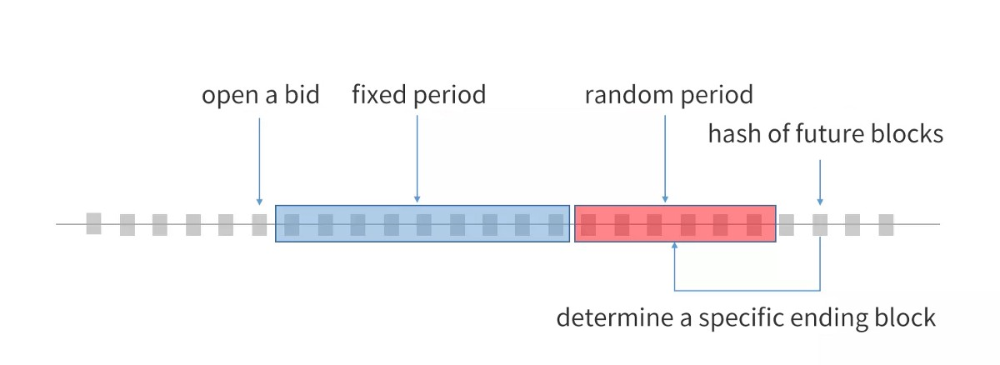

****************
Design Details
****************

NNS Protocol Specifications 
============================

The URL we usually use on the Internet is as follows,

::

    http://aaa.bbb.test/xxx 

1. HTTP is a protocol, the domain name and protocol will be passed on separately when NNS service is requested. 

2. aaa.bbb.test is the domain name, NNS service request using the hash of the domain name

3. Xxx is the path, the path is not processed at the DNS level, the same goes with nns, if there is a path, it will be processed in other ways. 

Definitions of using strings in NNS protocol
The following are tentative definitions.  

**HTTP**

 `HTTP protocol points to a string, which means it’s an Internet address.`

**addr** 

 `addr protocol points to a string, which means it’s an NEO address. Like: AdzQq1DmnHq86yyDUkU3jKdHwLUe2MLAVv`

**script** 
 
 `script protocol points to a byte[], which means a NEO ScriptHash. Like: 0xf3b1c99910babe5c23d0b4fd0104ee84ffeec2a5`

One and the same domain name is processed differently by different protocols. 

- http://abc.test  may point to http://www.163.com
- addr://abc.test  may point to AdzQq1DmnHq86yyDUkU3jKdHwLUe2MLAVv
- script://abc.test  may point to 0xf3b1c99910babe5c23d0b4fd0104ee84ffeec2a5

.. _namehash:

Detailed Explanation NameHash Algorithm 
========================================

Namehash
---------

The domain name NNS stores are 32byte hashes, rather than the plain text of the original domain name. Here are reasons for this design. 

1. A unified process allows any length of the domain name.

2. It preserves the privacy of the domain name to some extent. 

3. The algorithm for converting a domain name to a hash is called NameHash, 

Domain, Domainarray, and Protocol
----------------------------------

The URL we usually use on the Internet is as follows,

::

    http://aaa.bbb.test/xxx 

1. HTTP is a protocol, the domain name and protocol will be passed on separately when NNS service is requested. 

2. aaa.bbb.test is the domain name, NNS service request using the hash of the domain name

3. Xxx is the path, the path is not processed at the DNS level, the same goes with nns, if there is a path, it will be processed in other ways. 

NNS uses domain name’s array rather domain name, which is a more direct process. 
Domain name aaa.bb.test is converted into byte array as ["test","bb","aa"]
You could invoke the resolution this way

::

    NNS.ResolveFull("http",["test","bb","aa"]);

And let the contract to calculate namehash.

NameHash Algorithm 
--------------------

NameHash algorithm is a way to calculate hash step by step after converting domain name into DomainArray. Its code is as follows:

::

    // algorithm for converting domain names into a hash
    static byte[] nameHash(string domain)
    {
        return SmartContract.Sha256(domain.AsByteArray());
    }
    static byte[] nameHashSub(byte[] roothash, string subdomain)
    {
        var domain = SmartContract.Sha256(subdomain.AsByteArray()).Concat(roothash);
        return SmartContract.Sha256(domain);
    }
    static byte[] nameHashArray(string[] domainarray)
    {
        byte[] hash = nameHash(domainarray[0]);
        for (var i = 1; i < domainarray.Length; i++)
        {
            hash = nameHashSub(hash, domainarray[i]);
        }
        return hash;
    }

Quick Resolution
-----------------

Complete resolution introduces the whole DomainArray and let smart contracts to check every layer’s resolution one by one. Calculating NameHash could also be done on Client, and then is passed into smart contracts. It’s invoked this way:
::

    // query http://aaa.bbb.test
    var hash = nameHashArray(["test","bbb"]);// can be calculated by Client
    NNS.Resolve("http",hash,"aaa");// invoke smart contracts

or

::

    //query http://bbb.test
    var hash = nameHashArray(["test","bbb"]);// can be calculated by Client
    NNS.Resolve("http",hash,"");// invoke smart contracts

You may be thinking why querying aaa.bbb.test is not like this.

::

    // query http://aaa.bbb.test
    var hash = nameHashArray(["test","bbb","aaa"]);// can be calculated by Client
    NNS.Resolve("http",hash,"");// invoke smart contract

We have to consider whether aaa.bb.test has a separate resolver. If aaa.bb.test is sold to someone else, 
it specifies an independent resolver so that it can be queried. If aaa.bb.test does not have a separate resolver, it is resolved by bb.test’s resolver.
So this cannot be queried.

The first query, regardless of whether aaa.bb.test has an independent resolver, can be found. 

Detailed Explanation of Top-level Domain Name
================================================

Function Signature of Top-level Domain Name Contracts
------------------------------------------------------

The function signature is as follows:

::

    public static object Main(string method, object[] args)

Deploying adopts a configuration of parameter 0710, return value 05

Interface of Top-level Domain Name Contract
--------------------------------------------

Top-level domain name’s interface is composed of three parts
Universal interface. It does not require permission verification and can be invoked by everyone.
Owner interface. It is valid only when it’s invoked by the owner signature or the owner script.
Registrar interface. It’s valid only when it’s invoked by the registrar script. 

Universal Interface
--------------------

The universal interface doesn’t need permission verification. Its code is as follows.

::

    if (method == "rootName")
        return rootName();
    if (method == "rootNameHash")
        return rootNameHash();
    if (method == "getInfo")
        return getInfo((byte[])args[0]);
    if (method == "nameHash")
        return nameHash((string)args[0]);
    if (method == "nameHashSub")
        return nameHashSub((byte[])args[0], (string)args[1]);
    if (method == "nameHashArray")
        return nameHashArray((string[])args[0]);
    if (method == "resolve")
        return resolve((string)args[0], (byte[])args[1], (string)args[2]);
    if (method == "resolveFull")
        return resolveFull((string)args[0], (string[])args[1]);

rootName()
~~~~~~~~~~~~

Return the root domain name that the current top-level domain name corresponds to, its return value is a string. 

rootNameHash()
~~~~~~~~~~~~~~

Return NameHash the current top-level domain name corresponds to, its return values are byte[]

getInfo(byte[] namehash)
~~~~~~~~~~~~~~~~~~~~~~~~~~

Return a domain name’s information, its return value is an array as follows

::

    [
        byte[] owner//owner
        byte[] register//registrar
        byte[] resolver//resolver
        BigInteger ttl//TTL
    ]

nameHash(string domain)
~~~~~~~~~~~~~~~~~~~~~~~~

Convert a section of the domain name into NameHash. For example:

::

    nameHash("test") 
    nameHash("abc")

Its return value is byte[]

nameHashSub(byte[] domainhash,string subdomain)	
~~~~~~~~~~~~~~~~~~~~~~~~~~~~~~~~~~~~~~~~~~~~~~~~~~~~~~

Calculate subdomain name’s NameHash. For example:

::

    var hash = nameHash("test");
    var hashsub = nameHashSub(hash,"abc")// calculate abc.test’s namehash

it's return value is byte[]

nameHashArray(string[] nameArray)
~~~~~~~~~~~~~~~~~~~~~~~~~~~~~~~~~~~

Calculate NameArray’s NameHash，aa.bb.cc.test corresponding nameArray is ["test","cc","bb","aa"]

::

    var hash = nameHashArray(["test","cc","bb","aa"]);

resolve(string protocol,byte[] hash,string or int(0) subdomain)
~~~~~~~~~~~~~~~~~~~~~~~~~~~~~~~~~~~~~~~~~~~~~~~~~~~~~~~~~~~~~~~~~~~~~~

resolve a domain name 

The first parameter is a protocol 

For example, HTTP maps a domain name to an Internet address. 

For example, addr maps a domain name to an NEO address( which is probably the most common mapping)

The second parameter is the hash of the domain name that is to be resolved. 

The third parameter is the subdomain name that is to be resolved. 

The following code is applied.

::

    var hash = nameHashArray(["test","cc","bb","aa"]);//calculate by Client
    resolve("http",hash,0)//contract resolve http://aa.bb.cc.test

or

::

    var hash = nameHashArray(["test","cc","bb");// calculate by Client
    resolve("http",hash,“aa")//smart resolve http://aa.bb.cc.test

The return type is byte[], how to interpret byte[] is defined by different protocols. 
byte[] saves strings. We will write another document to explore protocols. 

Second-level domain name has to be resolved in the way of 

::

    resolve("http",hash,0). 
    
Other domain names are recommended to be resolved in the way of 

::

    resolve("http",hash,“aa"). 

resolveFull(string protocol,string[] nameArray)
~~~~~~~~~~~~~~~~~~~~~~~~~~~~~~~~~~~~~~~~~~~~~~~~~

Complete model of domain name resolution

The first parameter is protocol

The second parameter is NameArray

The only difference in this resolution is it verifies step by step whether the ownership is consistent with the registration.

Its return type is the same with resolve.

Owner Interface
-----------------

All of the owner interfaces are in the form of 

::

    owner_SetXXX(byte[] srcowner,byte[] nnshash,byte[] xxx). 
    
Xxx is  scripthash. 

The return value is one-byte array；[0] means succeed; [1] means fail 

The owner interface accepts both direct signature of account address calls and smart contract owner calls.
If the owner is a smart contract, the owner should determine their own authority. 
If it does not meet the conditions, please do not initiate appcall on the top-level domain contract. 

owner_SetOwner(byte[] srcowner,byte[] nnshash,byte[] newowner)
~~~~~~~~~~~~~~~~~~~~~~~~~~~~~~~~~~~~~~~~~~~~~~~~~~~~~~~~~~~~~~~~

Ownership transfer of domain names. The owner of a domain name could be either an account address or a smart contract. 

srcowner is only used to verify signature when the owner is an account address. It is the address’s scripthash. 

nnshash is the namehash of the domain name that is to be operated. 

newowner is the scripthash of new owners’ address. 

owner_SetRegister(byte[] srcowner,byte[] nnshash,byte[] newregister)
~~~~~~~~~~~~~~~~~~~~~~~~~~~~~~~~~~~~~~~~~~~~~~~~~~~~~~~~~~~~~~~~~~~~~~

Set up Domain Registrar Contract (Domain Registrar is a smart contract) Domain Registrar parameter form must also be 0710, return 05 
the following interface must be achieved. 

::

    public static object Main(string method, object[] args)
    {
        if (method == "getSubOwner")
            return getSubOwner((byte[])args[0], (string)args[1]);
        ...

        getSubOwner(byte[] nnshash,string subdomain)

Anyone can call the registrar's interface to check the owner of the subdomain.

There is no regulation for other interface forms of the domain name registrar. The official registrar will be explained in the future documentation.

The domain name registrar achieved by the user only need to achieve getSubOwner interface.

owner_SetResolve(byte[] srcowner,byte[] nnshash,byte[] newresolver)
~~~~~~~~~~~~~~~~~~~~~~~~~~~~~~~~~~~~~~~~~~~~~~~~~~~~~~~~~~~~~~~~~~~~~

Set up a domain name resolver contract (the domain name resolver is a smart contract) 

The domain name resolver’s parameter form also has to be 0710 and return 05 

the following interface has to be achieved. 

::

    public static byte[] Main(string method, object[] args)
    {
        if (method == "resolve")
            return resolve((string)args[0], (byte[])args[1]);
        ...
    
    resolve(string protocol,byte[] nnshash)

Anyone can call the resolver interface for resolution. 

There are no regulations for other interface forms of domain name resolves. The official resolver will be explained in the future documentation.

The domain name registrar achieved by the user only need to achieve resolve interface.

Registrar Interface
--------------------

There is only one registrar interface that’s called by registrar smart contract. 

register_SetSubdomainOwner(byte[] nnshash,string subdomain,byte[] newowner,BigInteger ttl)
~~~~~~~~~~~~~~~~~~~~~~~~~~~~~~~~~~~~~~~~~~~~~~~~~~~~~~~~~~~~~~~~~~~~~~~~~~~~~~~~~~~~~~~~~~~~~

register a subdomain name
 
nnshash is the namehash of the domain names that are to be operated. 
 
subdomain is the subdomain name that is to be operated. 
 
newowner is the scripthash of the new owner’s address. 
 
TTL is the time to live of the domain name( block height)
 
If succeed, return [1], if fail, return [0]

Detailed Explanation of Owner Contract
========================================

Workings of the Owner Contract
-------------------------------
The owner contract calls the owner_SetXXX interface of top-level domain name contract in the form of Appcall. 

::

    [Appcall("dffbdd534a41dd4c56ba5ccba9dfaaf4f84e1362")]
    static extern object rootCall(string method, object[] arr);
 
The top-level domain name contract will check the call stack, comparing contract it’s called by and the owner that manages the top-level domain name contract.
So only the owner contract of a domain name can manage this domain name. 

Significance of the Owner Contract 
------------------------------------

Users could achieve complex contract ownership through the owner contract. 

For example:

Owned by two persons, dual signature

Owned by more than two persons, operate by voting

Detailed Explanation of Registrar
====================================

Workings of Registrar Contract
------------------------------

The registrar contract calls register_SetSubdomainOwner interface of the top-level domain name in the form of Appcall. 

::

    [Appcall("dffbdd534a41dd4c56ba5ccba9dfaaf4f84e1362")]
    static extern object rootCall(string method, object[] arr);

Top-level domain name contracts will check the call stack, comparing the contract it’s called by and the registrar the top-level domain name contract manages.

So only the specified registrar contract can manage it. 
the registrar interface 
 
The registrar’s parameter form also has to be 0710 and return 05 

::

    public static object Main(string method, object[] args)
    {
        if (method == "getSubOwner")
            return getSubOwner((byte[])args[0], (string)args[1]);
        if (method == "requestSubDomain")
            return requestSubDomain((byte[])args[0], (byte[])args[1], (string)args[2]);
        ...

getSubOwner(byte[] nnshash,string subdomain)
~~~~~~~~~~~~~~~~~~~~~~~~~~~~~~~~~~~~~~~~~~~~~~~~~

This interface is the norms and requirements of registrars. 
It has to be achieved because this interface will be invoked to verify rights when a complete resolution is conducted on the domain name. 

nnshash is the hash of the domain name

subdomain is the subdomain name

Return byte[] owner’s address, or blank

requestSubDomain(byte[] who,byte[] nnshash,string subdomain)
~~~~~~~~~~~~~~~~~~~~~~~~~~~~~~~~~~~~~~~~~~~~~~~~~~~~~~~~~~~~~~~

This interface will be used by first come first served registrar. Users call the interface of the registrar to register the domain name. 

Who means who applies

nnshash means which domain name is applied

subdomain means subdomain name applied

Detailed Explanation of the Resolver  
=======================================

The workings of the resolver contract

1. The resolver saves resolution information by itself.

2. The top-level domain name contract calls the resolution interface of the resolver to get resolution information in the way of nep4. 

3. When the resolver sets resolution data, it calls the getInfo interface of the top-level domain name contract to verify the ownership of the domain name in the way of Appcall. 

::

    [Appcall("dffbdd534a41dd4c56ba5ccba9dfaaf4f84e1362")]
    static extern object rootCall(string method, object[] arr);

Any contract could call the getInfo interface of the top-level domain name contract to verify the ownership of the domain name in the way of Appcall. 

Resolver Interface
-------------------

The resolver’s parameter form has be 0710, it returns 05. 

::

    public static byte[] Main(string method, object[] args)
    {
        if (method == "resolve")
            return resolve((string)args[0], (byte[])args[1]);
        if (method == "setResolveData")
            return setResolveData((byte[])args[0], (byte[])args[1], (string)args[2], (string)args[3], (byte[])args[4]);
        ...

resolve(string protocol,byte[] nnshash)
~~~~~~~~~~~~~~~~~~~~~~~~~~~~~~~~~~~~~~~~~~

This interface is the norms and requirements of resolvers. It has to be achieved because this interface will be called for final resolution when a complete resolution is conducted on a domain name. 

Protocol  is the string of the protocol

Nnshash  nnshash is the domains name that’s to be resolved. 

return byte[] is to resolve the data

setResolveData(byte[] owner,byte[] nnshash,string or int[0] subdomain,string protocol,byte[] data)
~~~~~~~~~~~~~~~~~~~~~~~~~~~~~~~~~~~~~~~~~~~~~~~~~~~~~~~~~~~~~~~~~~~~~~~~~~~~~~~~~~~~~~~~~~~~~~~~~~

This interface is owned by the standard resolver for demo. The owner(currently it only supports the owner of an account address) could call this interface to configure the resolution data. 

owner means the owner of a domain name.

nnshash means set up which domain name

subdomain the set-up subdomain name ( could pass 0; if the set-up is domain name resolution, non-subdomain name passes 0)

protocol means the string of protocols

data means resolves data

Return [1] means succeed, or [0] means fail. 

NNS Domain Name Registration Mechanism
===========================================

The domain name is a scarce and unique resource. 
The core issue that needs to be considered when designing such a system is how to maximize the value of the domain name. 
This does not mean that the higher the price of the domain name is speculated, the better it is. 

But there should be a reasonable process of value discovery and use. 
The first problem faced by the economic model of the domain name system is how to reasonably realize the initial registration and distribution of domain names?

Current Domain Name Registration
----------------------------------

In the registration mechanism of blockchain domain names, there are currently two typical registration methods. 
One is first-come, first-served, such as a Bitshares; and the other is ENS’s auction with sealed bidding registration.
Let’s first look at the specific steps as well as advantages and disadvantages of these two methods.

First come, first served is the main method of DNS domain registration. 
Service providers usually set different prices for different domain names. 
Due to the decentralized nature of blockchain domain names, there will be no complicated pricing in the 
first come, first served model. Either free or charge a unified registration fee. 
First come, first served method is relatively simple to implement, and the user operation is relatively simple. 
However, there is no market pricing process at the time of initial distribution, and there is no multi-participation. 
The domain name value needs to be discovered completely in the secondary market.

When there are few use cases for blockchain domain names, its value is not high and it is not used a lot, 
first come, first served method can be used as a convenient implementation, but when the demand for blockchain domain names increases, 
the first-come-first-served does not reflect the market demand well and does not maximize the value of domain names.

Ethereum’s domain name service ENS adopts a sealed auction registration method. 
Its registration process is composed of bid opening, placing, revealing, and bid winning?. 
The whole process lasts about 7 days, and the main part is placing a bid and revealing a bid process. 
The blockchain is an open and transparent ledger system. In order to achieve sealed bidding, the user’s bid consists of two parts, 
one is the real bid, and the other is the confusion money. 
Others can see your total bid in the system rather than your real bid to avoid the information advantage of later bidding. 
In the bid revealing stage, the user needs to send his own locally saved ciphertext to the smart contract to reveal the true bid. 
After the revealing period is over, the final bid winner will be determined.

The disadvantage of auctions with sealed bidding is that they cannot achieve a complete seal, 
and there will still be information leaks because the actual bid cannot exceed the total price. 
Second, the user experience is poor. The user needs to save the ciphertext and reveal the bid in the bid revealing period on time. 
Users need to do a lot of work, or it will lose the qualification and bid fund.

We believe that sealed bids are not completely sealed, and the auction experience is poor, so NNS hopes to find a better auction mechanism.

Transparent Bidding Mechanism
------------------------------

NNS will still use the bidding method to achieve the initial registration and distribution of domain names. 
However, unlike ENS, we adopt a transparent bidding mechanism. 
The advantage of this is that the user does not need to remember the ciphertext and there will be no bid revealing period. 
As long as the bidding is over, the final result can be known at once. 
However, there will be a problem with the transparent bidding. 
If the bidding period is certain, no one is willing to bid for the domain name at the beginning, 
because others can get a little more money to outbid you at the end of the auction. 
In order to solve the problem of the early bidding disadvantage, we introduce ``randomness`` at the end time of the auction. 
The auction is composed of two phases. 

**Fixed Period**

The first phase is a fixed period, for example, 3 days. 
All bids during this period are valid. 

**Random Period**

If someone bids on the last day of the fixed period, 
then here comes an additional two-day random period, otherwise the auction ends on the third day of the fixed period. 
During the random period, the end time of the auction is uncertain.

It is necessary to wait until the hash value of the futures blocks of two additional days is determined. 
According to the size of the interval, the latter someone bids, 
the more likely he or she is to fall out of the end time of the auction and thus the bidding will be invalid, 
so it’s better to bid as early as possible. 

**Ends of auction**

After a random period is finished, 
the bid ending block will be determined according to the hash of future blocks. 
The bid winner can be determined after all the bids from the bid opening and the ending block are collected.

The end result of this auction method is that if you think that nobody bids against you for a domain name, 
then you only need to bid within two days after opening the bid, 
then you can win a domain name after the fixed period is finished on the third day. 

If there is competition for a domain name, then the competition mainly occurs 
at both ends of the alternating period of the fixed period and the random period. 
By introducing a random end time of the auction, the late bidding is the less likely to fall within the valid period, 
avoiding the problem of the late bidding advantage caused by increasing transparency in the auction.

Rent mechanism
---------------

The registration mechanism only achieves the value discovery at the time of initial distribution. 
If the domain name is acquired by someone but never used, it is a waste of value. 
Later, we will analyze how to use the rent mechanism to promote the circulation in the secondary domain name market.

Cyclically redistributed SGAS token Technology
===================================================

In order to achieve the sound development of the NNS system, NNS introduces a cyclical token system, and introduces the equity tokens that provides redistribution proof of system income. The system is composed by three parts:

1. NNC Equity proof token.

2. SGAS NEP5 Token Contract.

3. Coinpool Bonus pool contract.

The main role of NNC is to provide the equity proof when the income from domain auctions is redistributed.

SGAS is a NEP5 asset that is bound to GAS based on a ratio of1:1 to facilitate the use of GAS in application contracts. CoinPool is a contract that receives domain name auction fees and performs redistribution management.

Redistribution mechanism
-----------------------------

NNS charges a fee when the user participates in a domain auction. This fee income will be redistributed based on the NNS users' NNC holdings and will be completely redistributed to NNC holders.

Bonus claiming mechanism
--------------------------------

The fee income of the NNS system will be transferred to the Bonus pool contract, which records the fee income. Users receive the bonus based on their NNC holdings via the bonus pool contract

Bonus pool details
------------------------------

All the SGAS that the domain name auction receives will be redistributed. The proportion of re-allocation is based on the users’ NNC holdings. For cost considerations, we use 10,000 blocks as the unit to explain this and re-distribute the charged SGAS. When a user has an NNC utxo asset and uses it after at least two units, he will be able to receive the dividend from the system income that occurs within blocks when he is in possession of that NNC UTXO asset. Each NNC utxo asset can receive SGAS from the system income that occurs within no more than 15 blocks. If he holds the asset for more than 15 units, the dividend will be claimed in installments. That is to say, if the user has been holding this UTXO asset and hasn’t sent it to another address, then he will always receive the SGAS dividend , but cannot claim it. He can claim the dividend only after the user sends this UTXO asset to another address. 

SGAS interface (Only more interface than NEP5)
~~~~~~~~~~~~~~~~~~~~~~~~~~~~~~~~~~~~~~~~~~~~~~~~~~~~~

SGAS first meets NEP5 specifications, but the NEP specification interface is  not described in details here. 

**mintTokens**

Exchange GAS for an equal amount of SGAS, then transfer it to the SGAS contract account, and then invoke contract's mintTokens to transfer equal amount of SGAS to your account. It needs signing. 

**refund**
	
The SGAS contract is used to convert the SGAS to the equivalent GAS. The SGAS contract checks the identity of the user and then constructs a contract transaction to transfer the GAS of the SGAS contract account to the user’s account and deducts the SGAS in the user’s account. This needs signing.

**Migrate**

Used for contract upgrades. It’s used when there is a problem with the contract that requires an updated version. Only super administrators have permission to call it.

CoinPool interface
~~~~~~~~~~~~~~~~~~~~~~~~~~~~

**setSGASIn(byte[] txid)**

It’s called by the NNS registrar contract to transfer the SGAS income to the bonus pool, which needs to verify the contract address. It can only be called via the NNS registrar. The parameter txid is the transaction ID of the transaction.

**countSGASOnBlock(BigInteger blockid)**

Used to view the amount of bonuses saved in the specified block range. The parameter blockid is the block height of the query.

**Claim**

Used by users to claim the SGAS in the bonus pool. 
